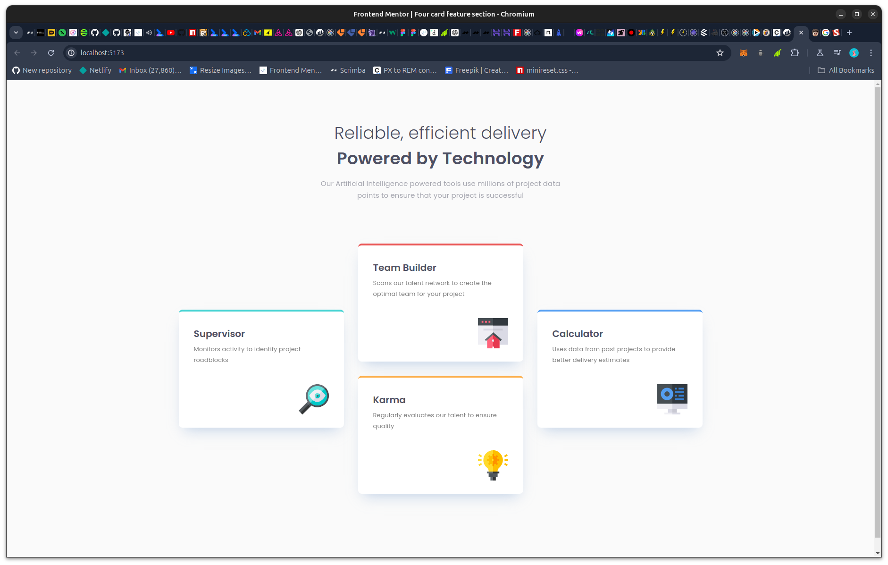

# Frontend Mentor - Four card feature section solution

This is a solution to the [Four card feature section challenge on Frontend Mentor](https://www.frontendmentor.io/challenges/four-card-feature-section-weK1eFYK). Frontend Mentor challenges help you improve your coding skills by building realistic projects. 

## Table of contents

- [Overview](#overview)
  - [Screenshot](#screenshot)
  - [Links](#links)
- [My process](#my-process)
  - [Built with](#built-with)
  - [What I learned](#what-i-learned)
  - [Continued development](#continued-development)
  - [Useful resources](#useful-resources)
- [Author](#author)

## Overview

### Screenshot



### Links

- Solution URL: [Github Repo](https://github.com/Achigyus/four-card-feature-section)
- Live Site URL: [Live Site](https://four-card-achigyus.netlify.app/)

## My process

### Built with

- Semantic HTML5 markup
- CSS custom properties
- Flexbox
- CSS Grid
- Mobile-first workflow
- [React](https://reactjs.org/) - JS library

### What I learned

I finally learned the correct way to use `clamp` for responsive typography.

```css
.four_card_feature_title{
  font-size: clamp(1.5rem, 1vw + 1.188rem, 2.25rem);
}
```

### Continued development

Continued development on CSS Grid and responsive coding.

### Useful resources

- [Resource to Learn Use of Clamp](https://www.smashingmagazine.com/2022/01/modern-fluid-typography-css-clamp/) - This is an amazing article which helped me finally understand `clamp`. I'd recommend it to anyone still learning this concept.

## Author

- Website - [Achigyus](https://github.com/Achigyus)
- Frontend Mentor - [@Achigyus](https://www.frontendmentor.io/profile/Achigyus)
- Twitter - [@ElUchihaAnbu](https://www.twitter.com/ElUchihaAnbu)